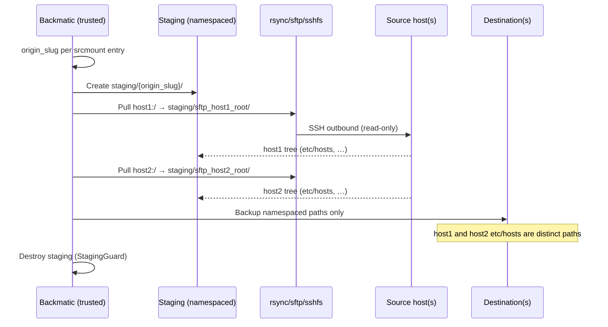
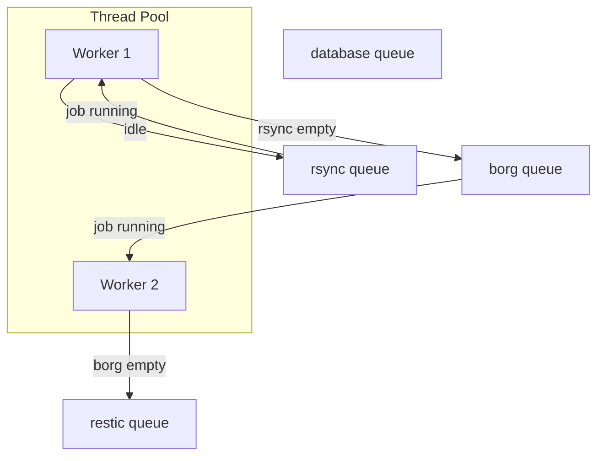

# Backmatic — Implementation Plan

This document is the master plan for implementing all items in [IMPROVEMENTS.md](IMPROVEMENTS.md), the additional features in [prompt.md](prompt.md), and a full automated test suite. The library and binary remain in **one repository** (`backmatic` crate with `src/lib.rs` + `src/main.rs`).

---

## Table of contents

1. [Goals and non-goals](#1-goals-and-non-goals)
2. [Target architecture](#2-target-architecture)
3. [Design decisions](#3-design-decisions)
4. [Configuration model](#4-configuration-model)
5. [Phased implementation](#5-phased-implementation)
6. [Feature specifications](#6-feature-specifications)
7. [Testing strategy](#7-testing-strategy)
8. [Tooling: Justfile, Docker, CI](#8-tooling-justfile-docker-ci)
9. [Documentation deliverables](#9-documentation-deliverables)
10. [Risks, dependencies, and open questions](#10-risks-dependencies-and-open-questions)
11. [Milestone summary](#11-milestone-summary)

---

## 1. Goals and non-goals

### Goals

- Refactor into a maintainable **library + binary** in the same repo.
- Implement **all 28 improvements** from IMPROVEMENTS.md.
- Add **8 new features** from prompt.md (srcmount, scheduling, global thread pool, healthchecks.io, YAML schema, PostgreSQL, Just/Docker, dependency injection).
- Deliver a **comprehensive test suite** covering rsync, borg, and restic with the scenarios listed in prompt.md.
- Ship production-ready **config validation**, **security practices**, and **operational tooling**.

### Non-goals (initial release)

- Windows support (Linux-first; mount/LUKS/SSH assumptions).
- GUI or web dashboard.
- Built-in backup encryption beyond what borg/restic/LUKS already provide.
- Running backups *on* untrusted source machines (explicitly rejected by design).

---

## 2. Target architecture

### 2.1 Crate layout (single repo)

```
backmatic/
├── Cargo.toml                 # [lib] + [[bin]]
├── schema/
│   └── backmatic.schema.json  # JSON Schema for editor validation
├── docker/
│   ├── Dockerfile
│   └── docker-compose.test.yml
├── Justfile
├── src/
│   ├── lib.rs                 # Public API
│   ├── main.rs                # Thin CLI entry (~30 lines)
│   ├── cli.rs                 # clap Args
│   ├── error.rs               # BackmaticError (thiserror)
│   ├── app.rs                 # Backmatic orchestrator + scheduler loop
│   ├── config/
│   │   mod.rs
│   │   types.rs               # serde structs per job type
│   │   load.rs                # load + env secret resolution
│   │   validate.rs            # semantic validation (overlap, dest paths)
│   │   defaults.rs            # XDG paths, thread defaults
│   │   schema.rs              # optional JSON Schema validation hook
│   ├── inject/
│   │   mod.rs                 # BackmaticContext, traits
│   │   clock.rs
│   │   commands.rs            # CommandExecutor trait + real impl
│   │   http.rs                # Healthchecks client trait
│   │   paths.rs               # ToolPaths (rsync, borg, …)
│   ├── scheduler/
│   │   mod.rs                 # Global work queue + thread pool
│   │   job.rs                 # Job enum, state machine, retries
│   │   cycle.rs               # Continuous mode (wall-clock + overrun policy)
│   │   job_state.rs           # Per-job lifecycle across cycles
│   ├── runners/
│   │   mod.rs                 # BackupRunner trait
│   │   rsync.rs
│   │   borg.rs
│   │   restic.rs
│   │   database/
│   │   │   mod.rs
│   │   │   mysql.rs
│   │   │   postgres.rs
│   ├── mount/
│   │   mod.rs
│   │   dest.rs                # LUKS/plain block device (fixed)
│   │   src_remote.rs          # SSH/SFTP pull → namespaced staging dir
│   │   origin.rs              # origin_slug, SourcedPath, effective_sources
│   │   guard.rs               # MountGuard RAII
│   ├── retention/
│   │   mod.rs                 # rsync hard-link retention + prune
│   │   policy.rs
│   ├── healthcheck/
│   │   mod.rs                 # healthchecks.io ping client
│   └── logging/
│       mod.rs                 # Term + optional JSON
├── tests/
│   ├── common/                # Shared harness (fixtures, assert helpers)
│   ├── unit/                  # Fast, no external tools
│   └── integration/           # Real rsync/borg/restic; gated by feature
└── examples/
    └── backmatic.yml
```

### 2.2 Dependency injection (`BackmaticContext`)

All hardcoded paths, clocks, and subprocess calls go through injectable traits:

```rust
pub struct BackmaticContext {
    pub paths: ToolPaths,           // from config + env + which(1) fallback
    pub commands: Arc<dyn CommandExecutor>,
    pub clock: Arc<dyn Clock>,
    pub http: Arc<dyn HttpClient>,
    pub fs: Arc<dyn FileSystem>,    // test doubles for hierarchy setup
}
```

- **Production**: `RealCommandExecutor`, `SystemClock`, `ReqwestClient`, `RealFileSystem`.
- **Unit tests**: mocks recording intended commands without execution.
- **Integration tests**: real executor, optional `FakeClock` for retention logic.

`ToolPaths` resolves each binary via (in order): per-job override → global config → env (`BACKMATIC_RSYNC_PATH`) → `which rsync`.

### 2.3 Job execution model (replaces phased runners)

**Current behavior**: rsync phase blocks until **all** rsync jobs finish (including retries) → then borg → then restic → then database. Idle threads cannot be used by the next type while rsync retries block the phase.

**New behavior**: single global thread pool with **type-priority scheduling** (no interleaving by default):

1. **rsync** jobs are preferred while any rsync job is pending or running.
2. When a thread is idle and no rsync job is **ready** to start, **borg** jobs may start — even if other rsync jobs are still running or retrying.
3. Same pattern for **restic** after borg, then **database**.

```
Thread pool (size = cores/2 by default)
    │
    ├── Priority 1: rsync queue   ──┐
    ├── Priority 2: borg queue      │ idle thread pulls from
    ├── Priority 3: restic queue    │ highest-priority queue
    └── Priority 4: database queue ─┘   that has work ready
```

**Thread accounting example**: pool size 4, 5 rsync jobs, 2 finished, 2 running, 1 retrying → 1 idle thread → **one borg job may start immediately** while rsync jobs 4 and 5 (and the retrying job) continue.

**No cross-type interleaving**: a global FIFO mixing `[rsync-1, borg-1, rsync-2, …]` is **not** used. Type order is always rsync → borg → restic → database; only **idle threads** spill into the next type.

**Retry semantics**: retries are **per job**. On retry, release the worker thread (re-queue with delay) so other jobs — including the next backup type — can use it.

**Per-job lifecycle** (see also §3.3):

| State | Meaning |
|-------|---------|
| `Pending` | Queued for this cycle, not yet started |
| `Running` | Actively executing |
| `Retrying` | Waiting between retry attempts |
| `Completed` | Finished successfully this cycle |
| `Failed` | Exhausted retries this cycle |

- On success → healthcheck success ping (`/ping/{uuid}`).
- On exhausted retries → healthcheck fail ping with context (§3.5).

**Default thread count**: `max(1, num_cpus::get() / 2)` unless `--threads` is explicitly set.

---

## 3. Design decisions

### 3.1 `srcmount` — structured mapping (confirmed)

**Decision**: use **structured mapping only**, mirroring `destmount` style. No URI shorthand.

`srcmount` is a **single optional object** or a **list of objects** when multiple remote sources must be staged independently (e.g. `host1:/` and `host2:/`).

```yaml
srcmount:
  protocol: rsync           # rsync | sshfs | sftp  (default: rsync)
  host: src.example.com
  port: 22
  user: backup-reader
  path: /                   # remote path to pull (e.g. /etc, /)
  identity_file: /etc/backmatic/keys/src_ro
  staging_dir: null         # auto temp dir if omitted; see §3.8 for layout
  ssh_options:
    - StrictHostKeyChecking=accept-new
```

List form (multiple remotes — **each gets a distinct origin namespace**, see §3.8):

```yaml
srcmount:
  - protocol: sftp
    host: host1.example.com
    user: backup
    path: /
    identity_file: /keys/host1
  - protocol: sftp
    host: host2.example.com
    user: backup
    path: /
    identity_file: /keys/host2
```

**Implementation (trusted backup host pulls from untrusted src)**:

1. Compute a stable **`origin_slug`** per `srcmount` entry (§3.8).
2. Create staging path: `{staging_base}/{origin_slug}/` (e.g. `/staging/sftp_host1_root/`).
3. Pull remote tree into that directory (contents of remote `path` appear under the slug dir).
4. Pass **only** namespaced staging paths as effective `src` to the backup runner.
5. `StagingGuard` (RAII) tears down staging on drop.

**Security**: outbound SSH only from backup host; no agent forwarding; read-only remote user; dedicated key per source.

### 3.2 `dest` and `destmount` — independent lists (confirmed)

**Decision**: `dest` and `destmount` are **not paired**. They represent two independent destination channels:

| Field | Purpose |
|-------|---------|
| `dest` | Ordinary destination paths (local or remote). **Optional** if at least one `destmount` is configured. |
| `destmount` | LUKS/plain block devices to mount **if available**. Each successful mount adds **additional** local destination path(s). |

**Minimum destination rule (confirmed)**: at least one of `dest` or `destmount` must be present. A job with **only** `destmount` entries (no `dest`) is valid — backups go exclusively to LUKS drives when mounted.

```yaml
borg:
  - comment: "Etc from two hosts to USB only"
    srcmount:
      - protocol: sftp
        host: host1.example.com
        user: backup
        path: /
        identity_file: /keys/host1
      - protocol: sftp
        host: host2.example.com
        user: backup
        path: /
        identity_file: /keys/host2
    destmount:
      - uuid: "12345678-1234-1234-1234-123456789abc"
        mountpoint: /mnt/usb
        password: ${LUKS_USB_PASSWORD}
        path: borg/host1-host2    # default "." → backup at /mnt/usb/
```

Example with both channels:

```yaml
rsync:
  - comment: "Home to local + USB"
    src: [/home/user/]
    dest:
      - /backup/local/home/
    destmount:
      - uuid: "12345678-1234-1234-1234-123456789abc"
        mountpoint: /mnt/usb
        password: ${LUKS_USB_PASSWORD}
        path: backups/home
```

**Effective destinations** at run time:

```
effective_dest = dest
               + [ resolved path for each successfully mounted destmount entry ]
               # destmount target = {mountpoint}/{path}  (path defaults to ".")
```

**Mount failure behavior**: if a `destmount` entry cannot be mounted, log a warning, skip that entry, and continue. The job fails only if **no effective destination** remains (all mounts failed and `dest` empty/unreachable).

**Validation rules**:

- At least one of `dest` or `destmount` must be non-empty.
- `destmount.path` defaults to `"."` (backup to `mountpoint` root) — **confirmed**.
- Each `destmount.path` (if relative) resolves under its `mountpoint`.
- No effective destination may be a subpath of any effective `src` (§6.2).
- `destmount` accepts a single object or a list (same flattening rules as `dest`).

### 3.8 Source origin attribution (confirmed)

**Problem**: multiple `srcmount` entries (or `src` + `srcmount`) can produce colliding paths — e.g. `host1:/etc/hosts` and `host2:/etc/hosts` would both appear as `etc/hosts` in a flat backup with no way to tell them apart on restore.

**Decision**: every file in a backup must be **unambiguously attributable** to its source (`src` path or `srcmount` host/protocol/path). Use a **two-layer strategy**:

#### Layer 1 — Namespaced staging paths (primary; all backends)

Each source root is placed under a unique directory derived from its origin:

```
{staging_base}/
  sftp_host1_root/          # origin_slug from protocol+host+path
    etc/hosts
    etc/hostname
  sftp_host2_root/
    etc/hosts               # distinct from host1's etc/hosts
  local_etc/                # local src /etc without srcmount
    hosts
```

**Origin slug algorithm** (stable, filesystem-safe):

```rust
fn origin_slug(protocol: Option<&str>, host: Option<&str>, path: &str) -> String {
    // protocol_host1_root  or  local_etc  for local-only src
    filenamify(&format!(
        "{}_{}_{}",
        protocol.unwrap_or("local"),
        host.unwrap_or("localhost"),
        path.trim_matches('/').replace('/', "_").if_empty("root")
    ))
}
```

- Remote `srcmount`: slug encodes `protocol`, `host`, and remote `path` (e.g. `sftp_host1_root`, `rsync_host2_var_data`).
- Local `src` (no `srcmount`): slug `local_{path}` (e.g. `local_etc` for `/etc`).
- Backup runners always receive **namespaced paths** as effective `src`, never a flat merge.

This ensures rsync destinations, borg archives, and restic snapshots all store files under distinct prefixes.

#### Layer 2 — Archive metadata (supplementary; borg & restic)

In addition to namespaced paths, embed origin in archive metadata for easier listing/filtering:

| Backend | Mechanism |
|---------|-----------|
| **borg** | Archive name per origin: `{repo}::{comment}-{origin_slug}-{timestamp}` when multiple origins in one job; single archive if one origin |
| **restic** | Tag per origin: `--tag origin:{origin_slug}`; paths already namespaced via staging |
| **rsync** | Destination tree mirrors origin prefixes: `{dest}/{origin_slug}/etc/hosts` |

**Recovery example** (`/etc/hosts` from host1 only):

```bash
# Borg — path in archive is namespaced
borg extract /mnt/usb/borg::job-sftp_host1_root-... etc/hosts  # under slug dir

# Restic — restore by path prefix or tag
restic restore latest --tag origin:sftp_host1_root --target /recovery/host1

# Rsync — copy from namespaced dest subtree
cp -a /backup/sftp_host1_root/etc/hosts /recovery/
```

**Config implication**: when `srcmount` is a list, the job may omit top-level `src` (backup entire staged trees) or list paths **relative to each remote `path`** applied per mount entry.

### 3.3 Continuous mode (`--continuous` / `-C`) — confirmed

**Problem**: `sleep(cycle_hours * 3600)` after each cycle causes **drift** equal to cycle runtime.

**Wall-clock schedule** (injectable `Clock`):

- `-C 24` runs on a **fixed 24-hour wall-clock schedule** anchored to the **start time of the first cycle**.
- Example: first cycle starts `2026-06-29 14:30` → next scheduled tick `2026-06-30 14:30`, regardless of cycle duration.

**Overrun policy — partial re-queue (confirmed)**:

When a scheduled cycle tick fires while the previous cycle is still active, **do not** enqueue a full duplicate set of jobs. Only jobs that **completed successfully** since the previous tick are eligible for the new cycle. Jobs still `Running` or `Retrying` continue uninterrupted — no second instance.

**Example**:

| Job | State when next tick fires | Action on tick |
|-----|---------------------------|----------------|
| Backup 1 | `Completed` | Enqueue fresh run for next cycle |
| Backup 2 | `Running` | Continue current run; do **not** enqueue duplicate |
| Backup 3 | `Retrying` | Continue retries; do **not** enqueue duplicate |

When Backup 2 later reaches `Completed`, it becomes eligible for the **next** scheduled tick (not retroactively for the current overrun tick). When Backup 3 exhausts retries (`Failed`), it becomes eligible again on the next tick (fresh attempt).

```rust
// scheduler/cycle.rs
struct CycleScheduler {
    anchor: DateTime<Local>,
    interval: Duration,
    cycle_index: u64,
}

// scheduler/job_state.rs
struct JobTracker {
    state: JobState,
    job_id: JobId,       // stable across cycles (type + comment + index)
    last_completed: Option<DateTime<Local>>,
}
```

On tick: `for job in jobs where job.state == Completed { enqueue(job) }`.

**Optional future flag** (not v1): `--at 02:00` for calendar-aligned runs independent of first-start anchor.

### 3.4 YAML schema approach

- Authoritative schema: `schema/backmatic.schema.json` (JSON Schema draft 2020-12).
- Rust: `serde` deserialize → `validator` crate for struct rules → optional `jsonschema` crate for full schema pass.
- **Dynamic rules** (not expressible in JSON Schema alone) in `config/validate.rs`:
  - `database` jobs must not set `exclude` like file backups (or define DB-specific rules).
  - `srcmount` only on rsync/borg/restic; structured mapping only.
  - `dest` and `destmount` are independent; at least one must be present.
  - `destmount.path` defaults to `"."`.
  - Each `destmount.path` resolves under its `mountpoint`.
  - Effective destinations must not be subpaths of any effective namespaced `src`.
  - Multiple `srcmount` entries must produce distinct `origin_slug` values (collision → config error).
  - `keep_*` only where retention applies (rsync local, borg, restic).
  - healthcheck `uuid` required when `healthcheck.url` is set.

Editor integration: document VS Code `yaml.schemas` mapping in README.

### 3.5 healthchecks.io — ping-only with failure context (confirmed)

**Decision**: implement **ping-only** first (no API token). Self-hosted healthchecks.io compatible.

Per-job optional block:

```yaml
healthcheck:
  url: https://healthchecks.example.com   # base URL, no trailing slash
  uuid: 11111111-2222-3333-4444-555555555555
```

**Endpoints**:

| Event | HTTP | Body |
|-------|------|------|
| Success | `POST {url}/ping/{uuid}` | empty |
| Failure | `POST {url}/ping/{uuid}/fail` | plain-text context (see below) |

**Failure ping body** must include enough context for the operator to diagnose without reading logs:

```
job_type=restic
comment=Offsite restic
cycle=2026-06-29T14:30:00+02:00
attempts=23/23
last_error=restic backup exited with code 1
logfile=/var/log/backmatic/backup-restic_Offsite_202606291430.log
dest=/mnt/restic-repo
```

- `last_error`: stderr tail (last N lines, secrets redacted) or summarized `BackmaticError` chain.
- `logfile`: path to the job log for full details.
- Never include passwords or key material in the ping body.

Triggers:

- **Success**: after job completes all effective destinations successfully.
- **Failure**: after final retry exhausted.

Also log the same context locally at `error!` level. Use injected `HttpClient`; unit tests mock HTTP and assert body contents (T18).

### 3.6 PostgreSQL extension

```yaml
database:
  - engine: postgres          # mysql | postgres (default: mysql for backward compat)
    comment: "PG dump"
    host: localhost
    port: 5432
    user: backup
    password: ${PG_PASSWORD}
    src: [mydb, analytics]    # database names; empty = all
    dest: [/backup/postgres]
```

- Tool: `pg_dump` (custom format `-Fc` or plain SQL gzip — recommend **custom `-Fc`** for selective restore in tests).
- Same pairing semantics as MySQL: each `src` × `dest`.
- `destmount` support added for database jobs.

### 3.7 Secrets

- Syntax: `${VAR}` and `${VAR:-default}` in any string field.
- Resolve at config load from environment.
- Never log resolved secrets; redact in debug output.

---

## 4. Configuration model

### 4.1 Top-level file structure

```yaml
# schema/backmatic.schema.json validates this shape
version: 1                     # new: config version for migrations

defaults:
  logdir: /var/log/backmatic
  tools:                         # global tool path overrides
    rsync: /usr/bin/rsync
    borg: /usr/bin/borg
    restic: /usr/bin/restic
    mysqldump: /usr/bin/mysqldump
    pg_dump: /usr/bin/pg_dump

rsync: [ ... ]
borg: [ ... ]
restic: [ ... ]
database: [ ... ]
```

### 4.2 `srcmount` entry structure

| Field | Required | Description |
|-------|----------|-------------|
| `protocol` | no | `rsync` (default), `sshfs`, or `sftp` |
| `host` | yes | Remote hostname or IP |
| `port` | no | SSH port; default `22` |
| `user` | yes | SSH/SFTP user (read-only on source) |
| `path` | yes | Remote directory to pull (e.g. `/`, `/etc`) |
| `identity_file` | recommended | Private key path on backup host |
| `staging_dir` | no | Override base staging path; per-entry slug subdir always added |
| `ssh_options` | no | Extra SSH config lines |

Staging target for this entry: `{staging_base}/{origin_slug}/` where `origin_slug` is derived from `protocol`, `host`, and `path` (§3.8).

### 4.3 `destmount` entry structure

Each `destmount` list item uses structured mapping (same style as `srcmount`):

| Field | Required | Description |
|-------|----------|-------------|
| `uuid` | yes | Block device UUID (`/dev/disk/by-uuid/<uuid>`) |
| `mountpoint` | no | Where to mount; default `/mnt/backapp/<uuid>` |
| `password` | no | LUKS passphrase; omit for plain filesystem |
| `path` | no | Backup subdirectory relative to `mountpoint`; default `"."` (**confirmed**) |

Resolved backup target: `{mountpoint}/{path}` (after successful mount).

### 4.4 Shared job fields (all backup types)

| Field | rsync | borg | restic | database |
|-------|:-----:|:----:|:------:|:--------:|
| comment | ✓ | ✓ | ✓ | ✓ |
| logdir | ✓ | ✓ | ✓ | ✓ |
| src | ✓ | ✓ | ✓ | ✓ (db names) |
| dest | ✓† | ✓† | ✓† | ✓ |
| exclude | ✓ | ✓ | ✓ | — |
| password | — | ✓ | ✓ | ✓ |
| destmount | ✓ | ✓ | ✓ | ✓ (new) |
| srcmount | ✓ | ✓ | ✓ | — |
| keep_* | ✓ (local) | ✓ | ✓ | — |
| healthcheck | ✓ | ✓ | ✓ | ✓ |
| prune (restic) | — | — | always (after forget) | — |

† `dest` optional when `destmount` is set; at least one of `dest` or `destmount` required.

\* At least one of `src` or `srcmount` required for rsync/borg/restic.

---

## 5. Phased implementation

Work is split into phases that can be reviewed and merged incrementally. Each phase ends with tests green and docs updated.

### Phase 0 — Foundation (week 1)

| ID | Task | IMPROVEMENTS |
|----|------|--------------|
| 0.1 | Add `src/lib.rs`, move modules, thin `main.rs` | #2 |
| 0.2 | Introduce `BackmaticError`, replace `expect`/`panic` in config path | #9, #10 |
| 0.3 | `serde_yaml` + typed config structs | #3, #17 |
| 0.4 | Remove `yaml-rust`, unused `command` dep | #17, #18 |
| 0.5 | XDG defaults + `BACKMATIC_CONFIG` env | #5, #7 |
| 0.6 | `ToolPaths` + env overrides | #26, DI |
| 0.7 | `CommandExecutor` abstraction | #4, DI |
| 0.8 | Fix retry off-by-one | #11 |
| 0.9 | GitHub Actions: fmt, clippy, test | #21 |

**Exit criteria**: `cargo test` unit tests for config parsing; no behavior change yet for backups.

### Phase 1 — Core execution refactor (week 2)

| ID | Task | IMPROVEMENTS |
|----|------|--------------|
| 1.1 | `BackupRunner` trait; migrate rsync/borg/restic/database | #1 |
| 1.2 | Global scheduler + type-priority queues (no interleaving) | Feature #4 |
| 1.2b | `JobTracker` + partial re-queue on continuous overrun | Feature #3 |
| 1.3 | Default threads = `cpus/2` | Feature #4 |
| 1.4 | `MountGuard` RAII; fix cryptsetup + LUKS mapper path | #12, #13, #14, #15 |
| 1.5 | `destmount` for database jobs | #16 |
| 1.6 | Meaningful exit codes | #24 |
| 1.7 | Wall-clock aligned continuous mode | Feature #3 |

**Exit criteria**: existing manual smoke test passes; scheduler tests with mock runners.

### Phase 2 — Config validation & schema (week 3)

| ID | Task | IMPROVEMENTS |
|----|------|--------------|
| 2.1 | `config/validate.rs` semantic rules | #6 |
| 2.2 | `schema/backmatic.schema.json` with `oneOf` per type | Feature #6 |
| 2.3 | src/dest overlap detection | Tests requirement |
| 2.4 | Secret `${ENV}` resolution | #8 |
| 2.5 | `--dry-run` mode | #23 |
| 2.6 | Optional JSON log format | #22 |

**Exit criteria**: invalid configs fail with clear errors; schema loads in VS Code.

### Phase 3 — New features (week 4–5)

| ID | Task |
|----|------|
| 3.1 | `srcmount` + **origin attribution** (staging namespaces, borg/restic metadata) |
| 3.2 | `destmount` as independent list (additional destinations) |
| 3.3 | healthchecks.io ping-only client with failure context body |
| 3.4 | PostgreSQL `pg_dump` runner |
| 3.5 | Restic always `forget` + `prune` per `keep_*` retention | #27 |
| 3.6 | Borg/restic shared repo-init helper | #4 |

**Exit criteria**: feature-specific unit + integration tests.

### Phase 4 — Test suite (week 5–7, overlaps Phase 3)

See [Section 7](#7-testing-strategy). Deliver incrementally per runner.

### Phase 5 — Tooling & docs (week 7–8)

| ID | Task |
|----|------|
| 5.1 | Justfile (build, test, audit, docker) |
| 5.2 | Minimal Docker image + compose for tests |
| 5.3 | Update README, IMPROVEMENTS → mark done |
| 5.4 | `examples/backmatic.yml` |

---

## 6. Feature specifications

### 6.1 srcmount and origin attribution (detailed flow)



**Effective source resolution**:

```rust
struct SourcedPath {
    origin_slug: String,       // e.g. "sftp_host1_root"
    local_path: PathBuf,       // e.g. "/tmp/staging/sftp_host1_root"
    protocol: Option<String>,
    host: Option<String>,
    remote_path: Option<String>,
}

fn effective_sources(job: &Job) -> Vec<SourcedPath> {
    let mut sources = vec![];
    for mount in &job.srcmount {
        let slug = origin_slug(mount);
        let staging = staging_base.join(&slug);
        pull_remote_into(mount, &staging);
        sources.push(SourcedPath { origin_slug: slug, local_path: staging, ... });
    }
    for local in &job.src {
        let slug = origin_slug_local(local);
        sources.push(SourcedPath { origin_slug: slug, local_path: local.clone(), ... });
    }
    sources
}
```

Borg/restic runners iterate per `SourcedPath` (or batch with distinct archive names/tags per §3.8).

### 6.2 Destination resolution and path overlap validation

**Effective destination resolution** (at job run time):

```rust
fn effective_destinations(job: &Job) -> Vec<PathBuf> {
    let mut dests = job.dest.clone();
    for mount in &job.destmount {
        if let Ok(mounted) = mount_and_resolve(mount) {
            dests.push(mounted.resolved_path());
        } else {
            log::warn!("destmount {} skipped", mount.uuid);
        }
    }
    dests
}
```

Before any job runs:

1. Canonicalize effective namespaced `src` paths, `dest`, and resolved `destmount` paths.
2. Reject if any effective destination is equal to or a **subpath of** any effective source tree.
3. Reject duplicate `origin_slug` values within a job.
4. Log warning when `exclude` might not cover nested dest (edge case).

**Job failure when dest-only-on-LUKS**: if `dest` is empty and every `destmount` fails to mount → job fails with clear error (`no available destination`).

### 6.4 Scheduler — type-priority with thread borrowing



Worker selection algorithm:

```rust
fn next_job(queues: &PriorityQueues) -> Option<JobId> {
    for queue in [rsync, borg, restic, database] {
        if let Some(job) = queue.next_ready() {
            return Some(job);
        }
    }
    None
}
```

`next_ready()` skips jobs already `Running` or `Retrying` (no duplicate instances).

### 6.5 Continuous mode — overrun example

```
14:30  Cycle 1 starts → jobs 1, 2, 3 enqueued
14:45  Job 1 completes (Completed)
15:00  Job 2 still Running; Job 3 Retrying
─── 14:30 next day (tick) ─── overrun ───
       → enqueue Job 1 only (Completed)
       → Job 2, 3 continue unchanged
16:00  Job 2 completes (Completed) — eligible for 14:30+48h tick
17:30  Job 3 exhausts retries (Failed) — eligible for next tick
```

### 6.3 Recovery semantics in tests

| Backend | Restore method under test |
|---------|---------------------------|
| rsync | Copy from `{dest}/{origin_slug}/…` subtree; verify per-host file content |
| borg | `borg extract ::{comment}-{origin_slug}-…` selective path; list archives filtered by origin slug |
| restic | `restic restore --tag origin:{origin_slug}` or path prefix `{origin_slug}/etc/hosts` |

**Multi-origin test (T23)**: two `srcmount` entries with identical relative paths (`/etc/hosts`) → after backup, restore host1 copy only → content matches host1, not host2.

---

## 7. Testing strategy

### 7.1 Test pyramid

```
                    ┌─────────────────┐
                    │  LUKS / SSH e2e │  few, privileged, optional CI job
                    ├─────────────────┤
                    │ Integration      │  rsync/borg/restic + DB containers
                    │ (real binaries)  │
                    ├─────────────────┤
                    │ Unit + mocks     │  config, scheduler, retention math
                    └─────────────────┘
```

### 7.2 Cargo features

```toml
[features]
default = []
integration-tests = []      # real rsync, borg, restic required
integration-luks = []       # requires root + loop + cryptsetup
integration-ssh = []        # testcontainers openssh
integration-db = []         # testcontainers mysql + postgres
```

```bash
cargo test                          # unit only
cargo test --features integration-tests
cargo test --all-features           # CI nightly
```

### 7.3 Shared test harness (`tests/common/`)

- `TestTree`: builds directory hierarchies with known files and SHA256 checksums.
- `TimeTravel`: wraps injectable `Clock` for retention (no root required in unit tests).
- `CommandRecorder`: mock `CommandExecutor` for command construction tests.
- `DockerTestServices`: MySQL, Postgres, OpenSSH for integration (behind features).

### 7.4 Required scenarios × backends

Each scenario runs for **rsync**, **borg**, and **restic** unless marked N/A.

| # | Scenario | Approach |
|---|----------|----------|
| T1 | **Initial backup** — all files present at dest | Create `src/tree/{a,b,c}` with content; run backup; assert dest matches checksums |
| T2 | **Incremental** — second run, no changes | Run twice; assert idempotent (rsync: no unnecessary churn; borg/restic: new snapshot, deduped data) |
| T3 | **Add files** between backups | Add `d/new.txt`; backup; assert present |
| T4 | **Modify files** | Change content; backup; assert new content; old snapshot retains old content (borg/restic/rsync snapshot) |
| T5 | **Remove files** | Delete `b/`; backup; assert removed from live dest; verify prior snapshot still has `b/` |
| T6 | **Diff between backups** | Compare snapshot N vs N-1 file lists and hashes |
| T7 | **Restore** | Restore from latest; assert tree equals pre-delete state (T5) |
| T8 | **Retention hourly/daily/…** | Use `FakeClock`; advance time; assert correct snapshots remain after prune |
| T9 | **Pruning** | Create excess snapshots; run prune; assert count ≤ `keep_*` |
| T10 | **Exclude simple** | `exclude: [skip.txt]` |
| T11 | **Exclude wildcard** | `exclude: [*.tmp]` |
| T12 | **Exclude glob path** | `exclude: [nested/*.log]` |
| T13 | **dest under src rejected** | Config load fails validation |
| T14 | **srcmount pull** | OpenSSH container; sshfs/rsync pull; backup; verify content (feature `integration-ssh`) |
| T15 | **LUKS destmount** | Loop file + cryptsetup; backup; umount (feature `integration-luks`) |
| T16 | **Database MySQL** | testcontainers MySQL; dump; gzip; assert restore (feature `integration-db`) |
| T17 | **Database PostgreSQL** | testcontainers Postgres; pg_dump; assert restore |
| T18 | **healthcheck ping** | Mock HTTP; assert `/ping/{uuid}` on success; assert `/ping/{uuid}/fail` body contains job_type, comment, last_error, logfile |
| T19 | **Type-priority thread borrowing** | 5 slow rsync mocks + 2 borg; pool=4; assert borg starts while rsync still running; assert no restic until borg queue non-empty and rsync+borg threads saturated correctly |
| T20 | **Continuous partial re-queue** | FakeClock; overrun tick; assert only `Completed` jobs re-enqueued; `Running`/`Retrying` not duplicated |
| T21 | **dest + destmount independent** | Job with 1 `dest` + 2 `destmount`; one mount fails; assert backup reaches `dest` + successful mount path only |
| T22 | **Restic forget + prune** | Create excess snapshots; assert `forget` and `prune` both run; snapshot count ≤ `keep_*` |
| T23 | **Multi-srcmount origin attribution** | host1 + host2 both have `etc/hosts`; backup; restore host1 only; paths/tags distinct (rsync, borg, restic) |
| T24 | **destmount-only job** | No `dest`, one `destmount`; assert backup succeeds to LUKS path only; fails when mount unavailable |

### 7.5 Time manipulation for retention

**Unit tests (preferred)**: retention functions take `&dyn Clock`; advance fake time; no root.

**Integration tests (optional)**: CI job with `libfaketime` preloaded for one end-to-end rsync retention test — mark `#[ignore]` by default.

### 7.6 LUKS integration test outline

1. `dd` loop file 64MB.
2. `cryptsetup luksFormat` / `luksOpen` (requires root or `CAP_SYS_ADMIN` in CI).
3. `mkfs.ext4`, mount via **backmatic `destmount`**.
4. Run backup; verify files; verify umount on drop.

Run in dedicated GitHub Actions job: `runs-on: ubuntu-latest` with `options: --privileged` only for LUKS job.

### 7.7 Test data layout example

```
tests/fixtures/trees/basic/
├── file1.txt          # "version 1"
├── dir/
│   └── file2.bin
└── skip/
    └── skip.txt       # excluded
```

Generated at runtime in `tempfile::TempDir` by `TestTree::basic()` to avoid large binaries in git.

### 7.8 Coverage targets

- **Unit**: ≥ 80% line coverage on `config/`, `scheduler/`, `retention/`, `validate/`.
- **Integration**: all T1–T13 for rsync, borg, restic.
- **T14–T17**: at least one CI pipeline (nightly or manual workflow_dispatch).

---

## 8. Tooling: Justfile, Docker, CI

### 8.1 Justfile recipes

```just
# Proposed recipes
default:
    @just --list

build:
    cargo build --release

test:
    cargo test

test-unit:
    cargo test --lib

test-integration:
    cargo test --features integration-tests --test '*' -- --test-threads=1

clippy:
    cargo clippy --all-targets -- -D warnings

fmt:
    cargo fmt --all

audit:
    cargo audit
    cargo deny check

schema-validate example:
    # validate examples/backmatic.yml against schema (jsonschema CLI or custom)

docker-build:
    docker build -f docker/Dockerfile -t backmatic:latest .

docker-run *ARGS:
    docker run --rm \
      -v "${BACKMATIC_CONFIG:-./examples/backmatic.yml}:/config/backmatic.yml:ro" \
      -v "${BACKMATIC_SRC:-./data/src}:/data/src:ro" \
      -v "${BACKMATIC_DEST:-./data/dest}:/data/dest" \
      -v "${BACKMATIC_KEYS:-./keys}:/keys:ro" \
      backmatic:latest {{ARGS}}
```

### 8.2 Docker image

**Base**: `debian:bookworm-slim` (glibc, apt for tools).

**Included packages** (minimal):

- `rsync`, `borgbackup`, `restic`, `openssh-client`, `sshfs`, `cryptsetup`
- `mysqldump` / `default-mysql-client`, `postgresql-client`
- `gzip`, `mount`, `util-linux`

**Not in image**: config, src data, dest data, SSH keys (volume-mounted).

**Multi-stage build**:

1. `rust:bookworm` → compile `backmatic` release binary.
2. Copy binary + install runtime deps only → final image &lt; 200MB target.

### 8.3 CI pipelines (GitHub Actions)

| Workflow | Trigger | Contents |
|----------|---------|----------|
| `ci.yml` | push, PR | fmt, clippy, unit tests, schema check |
| `integration.yml` | PR, nightly | install borg/restic, integration-tests |
| `integration-privileged.yml` | nightly, manual | LUKS, optional faketime |
| `security.yml` | weekly | cargo-audit, cargo-deny |

Replace `.travis.yml` after GHA is stable.

---

## 9. Documentation deliverables

| Document | Action |
|----------|--------|
| README.md | Update for new config fields, srcmount, scheduling, Docker |
| IMPROVEMENTS.md | Check off items as completed |
| PLAN.md | This file; mark phases done |
| schema/backmatic.schema.json | New |
| examples/backmatic.yml | New comprehensive example |
| docs/TESTING.md | How to run integration/LUKS tests |
| docs/EDITOR.md | VS Code YAML schema setup |

---

## 10. Risks, dependencies, and open questions

### Risks

| Risk | Mitigation |
|------|------------|
| LUKS tests need privileges | Separate optional CI job; unit tests use mocks |
| sshfs in Docker needs `--device /dev/fuse` | Document; fallback to rsync-pull mode |
| Borg/restic versions differ in CI | Pin versions in Docker; version gate in tests |
| Global scheduler + retries complexity | State machine per job; extensive scheduler unit tests |
| Breaking YAML changes | `version: 1` field; migration doc |

### Resolved design decisions

| Topic | Decision |
|-------|----------|
| `srcmount` format | Structured mapping only (like `destmount`); no URI shorthand |
| `dest` vs `destmount` | Independent lists; `dest` optional when `destmount` set; at least one required |
| `destmount.path` default | `"."` (backup to mountpoint root) — **confirmed** |
| Multi-src origin attribution | Namespaced staging `{origin_slug}/` (primary) + borg archive name / restic tag (secondary) |
| Continuous overrun | Injectable `Clock`; on tick, re-enqueue only `Completed` jobs; `Running`/`Retrying` continue without duplicate |
| Restic prune | Always run `prune` after `forget`, honoring per-job `keep_*` retention |
| Job ordering | Type priority rsync → borg → restic → database; no cross-type interleaving; idle threads borrow into next type |
| healthchecks.io | Ping-only (`/ping/{uuid}`, `/ping/{uuid}/fail`); failure body includes job context for diagnosis |
| `srcmount` default protocol | `rsync` pull (fewer privileges); `sshfs` opt-in |
| `dest` optional | `dest` not required when `destmount` is set; at least one must exist |
| Failed job re-entry | When retries exhausted (`Failed`), job is eligible for re-enqueue on the **next scheduled tick** (fresh attempt) |

### Remaining open questions

1. **API token auth** for healthchecks: deferred to a future release (ping-only sufficient for v1).

---

## 11. Milestone summary

| Milestone | Duration | Deliverable |
|-----------|----------|-------------|
| M0 Foundation | ~1 week | lib/bin split, typed config, DI skeleton, CI |
| M1 Scheduler | ~1 week | global pool, fixed schedule, mount fixes |
| M2 Validation | ~1 week | schema, overlap checks, secrets |
| M3 Features | ~2 weeks | srcmount, healthchecks, postgres |
| M4 Tests | ~2 weeks | T1–T24 per backend |
| M5 Ship | ~1 week | Docker, Justfile, docs |

**Total estimate**: ~8 weeks for one developer, assuming part-time review cycles.

---

## Appendix A — IMPROVEMENTS.md traceability

| # | Title | Phase |
|---|-------|-------|
| 1 | Backup runner trait | 1.1 |
| 2 | lib/bin split | 0.1 |
| 3 | Typed config | 0.3 |
| 4 | Command executor | 0.7, 1.1 |
| 5 | XDG paths | 0.5 |
| 6 | Schema validation | 2.1–2.2 |
| 7 | BACKMATIC_CONFIG | 0.5 |
| 8 | Secrets | 2.4 |
| 9 | Result not panic | 0.2 |
| 10 | Real error types | 0.2 |
| 11 | Retry off-by-one | 0.8 |
| 12 | MountGuard | 1.4 |
| 13–15 | cryptsetup fixes | 1.4 |
| 16 | database destmount | 1.5 |
| 17 | serde_yaml | 0.3 |
| 18 | Remove command dep | 0.4 |
| 19 | Document concurrency | 5.3 |
| 20 | Real tests | Phase 4 |
| 21 | GitHub Actions | 0.9 |
| 22 | JSON logs | 2.6 |
| 23 | dry-run | 2.5 |
| 24 | Exit codes | 1.6 |
| 25 | PostgreSQL | 3.4 |
| 26 | Configurable paths | 0.6 |
| 27 | Restic prune | 3.5 |
| 28 | Notifications | 3.3 (healthchecks) |

## Appendix B — New dependencies (proposed)

| Crate | Purpose |
|-------|---------|
| `serde`, `serde_yaml` | Config |
| `validator` | Struct validation |
| `jsonschema` | Schema validation |
| `thiserror`, `anyhow` | Errors |
| `dirs` | XDG paths |
| `num_cpus` | Default thread count |
| `reqwest` | healthchecks HTTP (blocking or async with runtime) |
| `tempfile` | Staging dirs, tests |
| `sha2` | Checksum assertions in tests |
| `assert_cmd`, `predicates` | CLI integration |
| `testcontainers` | DB/SSH integration (dev-dep) |

---

*Design decisions in Section 10 are confirmed. Please review remaining open questions before implementation begins.*
